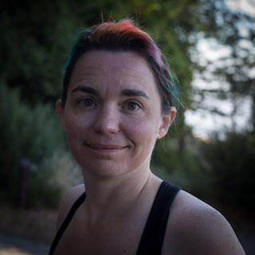

I'm incredibly excited to be a software developer. Especially now that I work at [Atomist](https://www.atomist.com) on automating everyone's software development.

I do some blogging, mostly at [medium](https://medium.com/@jessitron) ; 
older stuff is at
[abstractivate.jessitron.com](http://abstractivate.jessitron.com).

and some tweeting: [@jessitron](http://twitter.com/jessitron)

and some podcasting, on [&gt;Code](http://greaterthancode.com)

and some meetup-ing, in St. Louis

and some speaking.

2018 conference plans:

* 5-7 March, [QCon London](https://qconlondon.com/)
* 12-13 April, [Mob Programming](http://www.mobprogrammingconference.com/) in Boston (keynote)
* 25-26 April, [GOTO Chicago](https://gotochgo.com/)
* 17-18 May, [New Crafts](http://ncrafts.io/) in Paris
* 20 June, [Kansas City Java User Group](https://www.meetup.com/KansasCityJUG/events/247430450/)
* 17-20 July, [No Fluff Just Stuff](https://uberconf.com/conference/denver/2018/07/home) in Denver, CO
* 6-8 August, [THAT Conference](https://www.thatconference.com/) in Wisconsin
* 16-17 August, [REDeploy](https://re-deploy.io/2018/index.html) in San Francisco. (it was amazing!)
* 12-14 September, [Explore DDD](http://exploreddd.com) in Denver
* 9-10 October, [DevUp](https://devupconf.org/) in St. Charles, MO
* 26-28 October, [Pacific Northwest Software Symposium](https://nofluffjuststuff.com/conference/seattle/2018/10/schedule) (NFJS) in Seattle
* 5-7 November, [QCon](https://qconsf.com/sf2018) San Francisco (also track hosting)
* 29-30 November, [YOW! Sydney](http://yowconference.com.au/)
* 3-4 December, YOW! Melbourne
* 6-7 December, YOW! Brisbane
