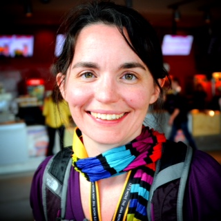

I'm incredibly excited to be a software developer.

I do some blogging:
[abstractivate.jessitron.com](http://abstractivate.jessitron.com)
and some tweeting: [@jessitron](http://twitter.com/jessitron)
and software development, at [Outpace](http://Outpace.com/careers) which is
amazing
and some podcasting, as a panelist on [Ruby Rogues](http://rubyrogues.com)
and some meetup-ing, at [Lambda Lounge](http://lambdalounge.org) and
[STL Ruby](http://meetup.com/stlruby) and
[Java](http://www.meetup.com/GatewayJUG/)
and some teaching programming to [my
sister](https://www.youtube.com/channel/UCrlq1XOiSijrMGWbBlKo2Eg)
and some speaking.

2015 conference plans:

* 3 Feb 2015, [JS Remote Conf](http://jsremoteconf.com)
* 7-8 April, [Philly ETE](http://phillyemergingtech.com)
* 22-24 April, [Craft Conf](http://craft-conf.com/2015) in Budapest
* 25-26 June, [KCDC](http://kcdc.info)
* 2-4 July, [PolyConf, Poznań, Poland](http://polyconf.com)
* 6 July, [special engagement at Ordina](http://www.ordina.nl/nl-nl/evenementen/innoveer-jij-mee-sessie-met-jessica-kerr/) in Utrecht, Netherlands
* 17-19 September, [Strange Loop](http://thestrangeloop.com)
* 16-18 November, [QCon San Francisco](https://qconsf.com)
* 10-11 December, [Scala eXchange](https://skillsmatter.com/conferences/6862-scala-exchange-2015) in London (keynote)
